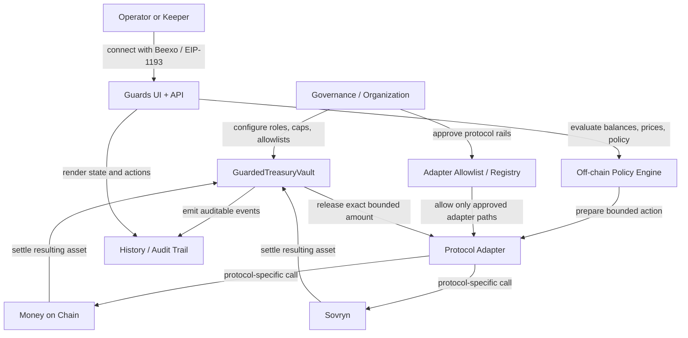

# Rootstock Contract Architecture

This document describes the **actual contract surface that exists today** and the **minimum contract architecture still missing** for Guards to become a bounded treasury execution product on Rootstock.

## Current Contract: `GuardedTreasuryVault`

Source:
- [`apps/blockchain/rootstock/contracts/src/GuardedTreasuryVault.sol`](/Users/nico/Projects-personal/Hackatons/guards-rootstock/apps/blockchain/rootstock/contracts/src/GuardedTreasuryVault.sol)

### What it does today

`GuardedTreasuryVault` is a **bounded treasury vault**, not a full policy engine.

It currently enforces:
- governance ownership
- operator role
- pause / unpause
- asset allowlist
- destination allowlist
- per-asset transfer caps
- replay protection via `referenceId`
- bounded `RBTC` and ERC20 transfers
- governance-only withdrawals
- auditable events for all guarded treasury actions

### What it does not do yet

It does **not** currently enforce or execute:
- market or oracle-based policy evaluation
- automatic rebalancing or keeper-triggered swaps
- slippage controls for protocol calls
- bounded protocol adapters for Money on Chain or Sovryn
- generic on-chain route validation
- policy stages like `watch`, `partial derisk`, `full exit`
- contract-level treasury automation against DeFi protocols

That means the current contract is deployable as a **guarded transfer vault**, but not yet as the full treasury automation system shown in the UI.

## Deployment Readiness

Today we can legitimately say:
- the current vault contract is ready for **testnet deployment as a guarded treasury vault**
- the repository already contains:
  - Foundry tests
  - a deploy script
  - a bootstrap/configure script
  - governance-signed bootstrap checks

Today we cannot honestly say:
- the full policy-based treasury automation stack is deployable
- Money on Chain / Sovryn execution is wired on-chain
- swaps are currently enforced by protocol-specific contract adapters

## Why the current contract is intentionally narrow

The current vault keeps the first on-chain surface small and auditable.

That is the right starting point for Rootstock because treasury products should not begin with a generic `arbitraryCall(bytes)` contract. That pattern is too permissive and too hard to reason about in a short hackathon window.

The safer progression is:
1. deploy a bounded custody vault
2. add protocol-specific adapters
3. let the off-chain policy engine decide *when* to act
4. let the on-chain contracts enforce *what is allowed to happen*

## Recommended Pending Contract Surfaces

### 1. `GuardedTreasuryVault` (already exists)

Purpose:
- custody layer
- governance and operator permissions
- bounded direct transfers and withdrawals
- treasury event source of truth

Status:
- implemented
- tested
- deployable to Rootstock testnet as a guarded vault

### 2. `ProtocolAdapterRegistry` or equivalent allowlist surface (missing)

Purpose:
- define which protocol adapters are trusted
- define which assets each adapter can handle
- define per-adapter notional caps
- define per-adapter slippage or minimum-out rules

This can live either as:
- a small standalone registry contract, or
- state added directly to `GuardedTreasuryVault`

The key requirement is the same: **the vault must not be able to call arbitrary protocol targets without an allowlisted adapter model**.

### 3. `MoneyOnChainAdapter` (missing)

Purpose:
- support bounded `RBTC <-> DOC` treasury actions
- provide explicit entrypoints such as:
  - `mintDoc(...)`
  - `redeemDoc(...)`
- validate exact input amount, minimum output, and destination behavior
- settle resulting assets back to the vault

Why this should be first:
- it is the strongest treasury narrative on Rootstock
- DOC is explicitly designed around Rootstock and Bitcoin-collateralized stable usage
- the flow is easier to explain to judges than a generic DEX swap story

References:
- [Rootstock Developers Portal](https://dev.rootstock.io/)
- [How to mint DOC](https://wiki.moneyonchain.com/using-money-on-chain/how-to-get-tokens/how-to-mint-tokens/how-to-mint-doc)
- [DOC stablecoin overview](https://moneyonchain.com/doc-stablecoin/)

### 4. `SovrynSwapAdapter` (missing)

Purpose:
- support bounded swap execution on Sovryn for explicitly allowed pairs
- enforce:
  - pair allowlist
  - exact input caps
  - min-out / slippage bounds
  - settlement back to the vault

Why this is second:
- useful for treasury movement workflows
- more flexible than Money on Chain
- but also easier to overgeneralize if adapter bounds are weak

Reference:
- [Sovryn AMM integration example](https://private.sovryn.com/blog/defiant-integrates-sovryns-amm)

### 5. Off-chain policy engine / keeper (UI + server side, not necessarily a contract)

Purpose:
- read balances and market data
- evaluate policy stages
- prepare bounded treasury actions
- submit only actions that the on-chain vault + adapters will accept

This part does **not** need to become an on-chain policy contract in the MVP.

For the MVP, the cleaner split is:
- policy evaluation: off-chain
- bounded execution enforcement: on-chain

## Recommended Operating Model

## Minimal Safe Flow For Protocol Actions

The intended bounded execution flow should be:

1. governance configures the vault
   - roles
   - allowed assets
   - allowed destinations
   - transfer caps

2. governance allowlists a protocol adapter
   - adapter contract address
   - supported asset pair
   - max notional
   - slippage / min-out policy

3. operator or keeper prepares one concrete action
   - action type
   - amount in
   - minimum amount out
   - protocol target implied by the adapter
   - reference id / action id

4. vault releases only the exact allowed amount

5. adapter performs only the protocol-specific action it was built for

6. resulting asset settles back to the vault

7. contracts emit events for auditability

## What the next TODOs should be

### Near-term contract TODOs
- implement adapter allowlist state either in the vault or in a small registry contract
- implement `MoneyOnChainAdapter` with bounded mint / redeem entrypoints
- implement `SovrynSwapAdapter` with bounded swap entrypoints
- add vault-to-adapter execution path with exact amount controls
- add end-to-end Foundry tests for:
  - vault -> adapter -> protocol -> vault settlement
  - replay protection for protocol actions
  - cap violations
  - slippage / min-out failures
  - wrong adapter / wrong asset rejection

### Product TODOs
- wire Beexo wallet flow to real Rootstock testnet actions
- show deployed vault + adapter addresses in the UI
- add one real testnet protocol action to the demo
- document tx hashes and network addresses for submission

## Decision Boundary

If time is short, the correct sequence is:
1. deploy `GuardedTreasuryVault` to Rootstock testnet
2. prove one bounded treasury transfer / withdrawal
3. implement **one** protocol adapter, preferably `MoneyOnChainAdapter`
4. demonstrate one bounded `RBTC <-> DOC` action
5. only then expand to broader swap / treasury automation
